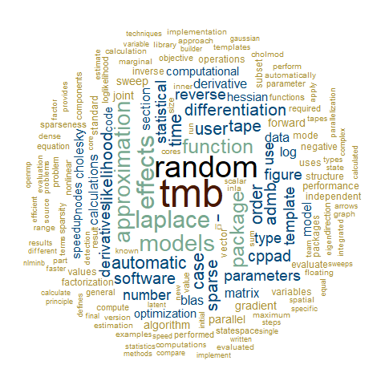

layout: true

.footnote[U.S. Department of Commerce | National Oceanic and Atmospheric Administration | National Marine Fisheries Service]


<style type="text/css">

code.cpp{
  font-size: 14px;
}
code.r{
  font-size: 14px;
}


</style>


```{r setup, include=FALSE}
options(htmltools.dir.version = FALSE)
library(mvtnorm)
library(plotly)
library(ggplot2)
library(knitr)
library(kableExtra)

```

```{r xaringan-tile-view, echo=FALSE}
# this gives you a tile navigation if you type "O" at any time
xaringanExtra::use_tile_view()
```
---
# Template Model Builder
```{r, echo = FALSE, out.width="45%", fig.align="center"}

```

Wordcloud generated from: ([Kristensen et al., 2015](https://backend.orbit.dtu.dk/ws/portalfiles/portal/123599315/Publishers_version.pdf))
---
# Statistical Computing Review

```{r, echo = FALSE, out.width="65%", fig.align="center"}

```

---
# Maximum Likelihood Inference

#### What is the likelihood of getting 30 heads in 100 coin flips?

.pull-left[
1. **Specify the model** <br><br>
$y ~ \sim Binomial(n, p)$
]
---
# Maximum Likelihood Inference

#### What is the likelihood of getting 30 heads in 100 coin flips?

.pull-left[
1. Specify the model
2. **Calculate the likelihood**<br><br>
\begin{align}
L(p; n, y) &= \frac{n!}{y!(n-y)!}p^y(1-p)^{n-y}
\end{align}
]

.pull-right[
$y = dbinom(x = 30, n = 100, p)$
```{r, eval=TRUE, echo = FALSE}
p <- seq(0,1,.01)
y <- round(dbinom(30,100,p),3)
df <- data.frame(y=y, p=p)
plotly::plot_ly(df, x=~p, y=~y, type = "scatter", mode = 'lines',
                width = 450, height = 375)
```
]
---

# Maximum Likelihood Inference

#### What is the likelihood of getting 30 heads in 100 coin flips?

.pull-left[
1. Specify the model
2. Calculate the likelihood
3. **Calculate the negative log-likelihood**

\begin{align}
-\ell(p; n, y) = &-[ln\big(\frac{n!}{y!(n-y)!}\big) + yln(p)\\
&+ (n-y)ln(1-p)]
\end{align}
]

.pull-right[
$nll = -log(dbinom(x = 30, n = 100, p))$
```{r, eval=TRUE, echo = FALSE}
p <- seq(0,1,.01)
nll <- round(-dbinom(30,100,p, TRUE),3)
df <- data.frame(nll=nll, p=p)
plotly::plot_ly(df, x=~p, y=~nll, type = "scatter", mode = 'lines',
                width = 450, height = 375)
```
]
---

# Maximum Likelihood Inference

#### What is the likelihood of getting 30 heads in 100 coin flips?

.pull-left[
1. Specify the model
2. Calculate the likelihood
3. Calculate the negative log-likelihood
\begin{align}
-\ell(p; n, y) = &-[ln\big(\frac{n!}{y!(n-y)!}\big) + yln(p)\\
&+ (n-y)ln(1-p)]
\end{align}

4. **Calculate the derivative w.r.t. $p$**
\begin{align}
\frac{d(\ell(p; n, y))}{dp} &= \frac{y}{p}- \frac{n-y}{1-p}
\end{align}
]

.pull-right[
$nll = -log(dbinom(x = 30, n = 100, p))$
```{r, eval=TRUE, out.width = '100%', echo = FALSE}
plotly::plot_ly(df, x=~p, y=~nll, type = "scatter", mode = 'lines',
                width = 450, height = 375)
```
]
---

# Maximum Likelihood Inference

#### What is the likelihood of getting 30 heads in 100 coin flips?

.pull-left[
1. Specify the model
2. Calculate the likelihood
3. Calculate the negative log-likelihood
4. Calculate the derivate wrt p
5. **Set to $0$ and solve for MLE**<br>

\begin{align}
0 &= \frac{y}{p}- \frac{n-y}{1-p} \\
E[p] &= \frac{y}{n} \\
E[y] &= np
\end{align}

]

.pull-right[
$nll = -log(dbinom(x = 30, n = 100, p))$
```{r, eval=TRUE, out.width = '100%', echo = FALSE}
plotly::plot_ly(df, x=~p, y=~nll, type = "scatter", mode = 'lines',
                width = 450, height = 375) %>% add_lines(
         y = c(-dbinom(30,100,.3,TRUE), -dbinom(30,100,.3,TRUE)), 
         x = c(0.1, 0.5), 
         line = list(color = "red"), 
         showlegend = FALSE 
        )
```
]

---
# Maximum Likelihood Inference

#### What is the likelihood of getting 30 heads in 100 coin flips?

.pull-left[
1. Specify the model
2. Calculate the likelihood
3. Calculate the negative log-likelihood
4. Calculate the derivate wrt p
5. Set to $0$ and solve for MLE
\begin{align}
0 &= \frac{y}{p}- \frac{n-y}{1-p}, \hspace{2mm} E[y] = np \\
\end{align}
6. **Approximate $Var[p]$ using the second derivative**<br>
\begin{align}
&-\frac{y}{p^2} - \frac{(n-y)}{(1-p)^2} = -\frac{np}{p^2} - \frac{(n-np)}{(1-p)^2}\\
 &= -\frac{n}{p} - \frac{n}{1-p}\\
l''(p) &= -\frac{n(1-p)}{p}
\end{align}
]

.pull-right[
\begin{align}
Var[p] &\approx -\frac{1}{l''(p)} \approx \frac{p(1-p)}{n}\\
SE[p] &\approx \sqrt{ .3(.7)/100} \approx .00458
\end{align}
```{r, eval=TRUE, out.width = '100%', echo = FALSE, warning=FALSE, message=FALSE}
p <- seq(0,1,.01)
y <- round(dbinom(30,100,p),3)
df <- data.frame(y=y, p=p)
confint <- .3 + c(-1,1)*2*sqrt(.3*.7/100)
confint.df <- data.frame(x=rep(confint[1], 2), 
                         y = c(dbinom(30,100,confint[1]), 0.1))

  plotly::plot_ly(x=df$p, y=df$y, 
                  type = "scatter", mode = 'lines',
                  width = 360, height = 300) %>%
  plotly::add_markers(x=.3, y=dbinom(30,100,.3), 
                      type = "scatter", 
                      showlegend = FALSE ) %>%
  plotly::add_segments(confint[1],0.04,
                       confint[1], 0,
                      line = list(color = "red"),
                      showlegend = FALSE ) %>%
  
  plotly::add_segments(confint[2], 0.04,
                       confint[2], 0, mode = 'lines',
                      line = list(color = "red"), 
                      showlegend = FALSE ) %>%
    plotly::add_text(x=.31, y=.01, text = "95% \nCI",
                      showlegend = FALSE )
  
```
]
---
# Multivariate asymptotics

* The second derivative measures the curvature of the likelihood surface
* For models with N parameters, the curvature is represented by an NxN **Hessian** matrix of 2nd partial derivatives
* Inverting the negative Hessian gives us a covariance matrix

.pull-left[
\begin{align}
(\mathbb{H}_{f})_{i,j} &= \frac{\partial^2f}{\partial \theta_{i}, \partial x\theta_{j}} = \frac{-1}{Var(\Theta)}
\end{align}
<br>
[**What causes a singular covariance matrix?**](https://andrea-havron.shinyapps.io/mvnplot/)
]

.pull-right[
```{r mvnorm, out.width = '80%', echo=FALSE, warning = FALSE, message=FALSE}

  cor2cov <- function(R,sd2){
    S <- c(sd2, sd2)
    diag(S) %*% R %*% diag(S)
  }

  C <- cbind(c(1, .4), c(.4, 1))
  Sigma <- cor2cov(C, 1)
  
  x <- seq(-3, 3,  .5)
    y <- x
    z <- matrix(0,length(x),length(y))
    for(i in 1:length(x)){
      for(j in 1:length(y)){
        z[i,j] <- dmvnorm(c(x[i],y[j]), sigma = Sigma)
      }
    }
  persp(x, y, -log(z), zlim = range(0,12))

```
]


---
# Automatic Differentiation

```{r, echo = FALSE, out.width="65%", fig.align="center"}

```
---
# What is AD?
<br>
```{r, echo = FALSE}
table.df <- data.frame(
  var0 = c("", "Efficiency:", "Accuracy:", "Higher order derivatives:"),
  var1 = linebreak(c("Derivatives calculated automatically using the chain rule", 
                           "forward mode: O(n); reverse mode: O(m)",
                           "Machine Precision",
                           "Easy")),
                var2 = c("Computer program converts function into exact derivative function", 
                         "O(2n)", 
                         "Exact",
                         "Difficult due to complexity"),
                var3 = c("Approximation that relies on finite differences", 
                         "O(n)", 
                         "Trade-off between truncation error and round-off error",
                         "Difficult due to error accumulation"))
colnames(table.df) <- c("", "Automatic Differentiation", 
                        "Symbolic Differentiation",
                        "Numerical Differentiation")

kbl(table.df) 
```
*O(n): Order of operations is based on the number of parameters <br>
*O(m): Order of operations is based on the number of outputs, in MLE inference, this is the nll
---
# Computational Graph (Tape)
<br>
.three-column-left[
```{Rcpp, eval = FALSE}
//Program
v1: x = ?
v2: y = ?
v3: a = x * y
v4: b = sin(y)
v5: z = a + b
```
]
.three-column[
```{r, echo = FALSE, out.width="100%", fig.align="left"}
knitr::include_graphics("static/comp-graph.png")
```
]
.three-column-left[
```{Rcpp, eval = FALSE}
//Reverse Mode
dz = ?
da = dz
db = dz
dx = yda
dy = xda + cos(y)db
```
]

---
# Reverse Mode
.pull-left[
**Static (TMB: CppAD, TMBad)**<br>
The graph is constructed once before execution
.p[
- Less flexibility with conditional statements that depend on parameters. 
- Atomic functions can be used when conditional statements depend on parameters
- High portability 
- Graph optimization possible
]]

.pull-right[
**Dynamic (Stan: Stan Math Library, ADMB: AUTODIF)**<br>
The graph is defined as forward computation is executed at every iteration
.p[
- Flexibility with conditional statements
- Optimization routine implemented into executable
- Less time for graph optimization
]
]

---

# TMB AD Systems
<br>
.pull-left[
**CppAD**
- [CppAD package](https://coin-or.github.io/CppAD/doc/cppad.htm)
]
.pull-right[
**TMBad**<br>
- TMBad is available with TMB 1.8.0 and higher
]
---
# R and C++ Type Systems

```{r, echo = FALSE, out.width="65%", fig.align="center"}

```
---
# Dynamic vs. Static Typing
<br>
.bluebox[
**Type System** <br>
A logical system comprising a set of rules that assigns a property called a type (for example, integer, floating point, string) to every "term" (a word, phrase, or other set of symbols) <br>
Source: [Wikipedia](https://en.wikipedia.org/wiki/Type_system)
]

.pull-left[
**R: Dynamic**
.p[
- Type checking occurs at run time
- The values and types associated with names can change
- Change in type tends to be implicit
]]

.pull-right[
**C++: Static**
.p[
- Type checking occurs at compile time
- The values associated with a given name can be limited to just a few types and may be unchangeable
- Change in type tends to be explicit
]]
---
# Dynamic vs. Static Typing
<br>
.pull-left[
**R: Dynamic**
- Flexible 
- Easy to debug at runtime
- Code is easier to read and write
- More errors detected later in development
- More tests are needed to detect errors
- Slower to run

```{r, echo = FALSE}
foo <- `+`
```

```{r}
`+`  <- `-`
1 + 1
```

```{r, echo = FALSE}
`+` <- foo
rm(foo)
```
]

.pull-right[
**C++: Static**
- Errors detected early in development
- Fewer errors occur at runtime
- Optimized code runs faster
- Code is harder to read and write
- Difficult to debug
<br><br>
```{r, echo = FALSE, out.width="65%", fig.align="center"}
knitr::include_graphics("static/RStudioBomb.png")
```

]


---
# What is the Template in TMB?
<br>
**Templated C++**
<br>
* Generic programming
* Allows developer to write functions and classes that are independent of Type
* Templates are expanded at compile time

.pull-left[
```{Rcpp, eval = FALSE}

template <class Type>
  Type add(Type x, Type y){
  return x + y;
}

int main(){
  int a = 1;
  int b = 2;
  double c = 1.1;
  double d = 2.1;
  int d = add(a,b);
  double e = add(c,d);
}

```
]
.pull-right[
```{Rcpp, eval = FALSE}
int add(int x, int y){
  return x + y;
}
double add(double x, double y){
  return x + y;
}
```
]


