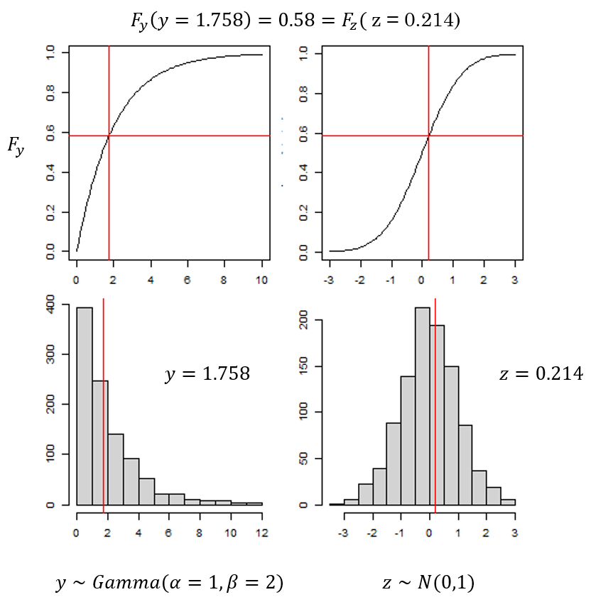
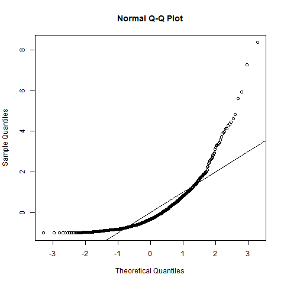
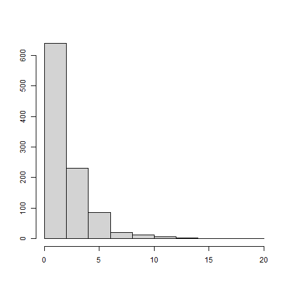
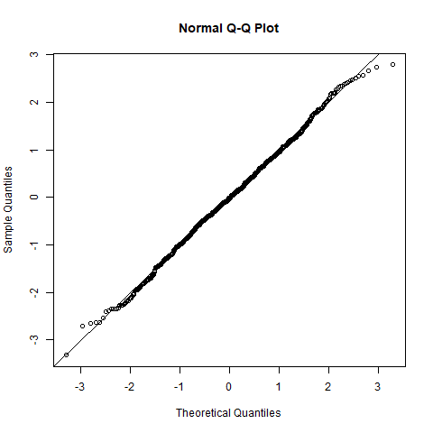
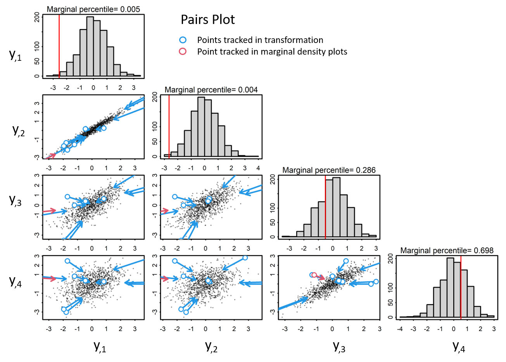
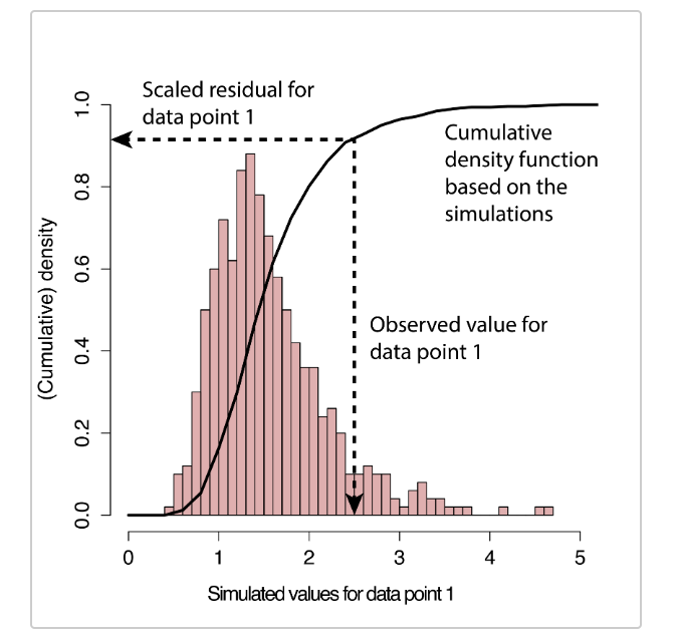
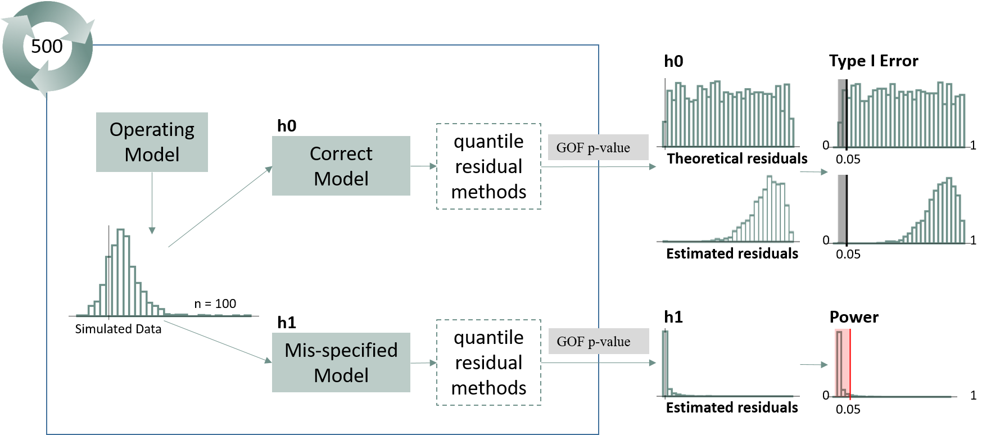

layout: true

.footnote[U.S. Department of Commerce | National Oceanic and Atmospheric Administration | National Marine Fisheries Service]


<style type="text/css">

code.cpp{
  font-size: 14px;
}
code.r{
  font-size: 14px;
}

.remark-slide-content > h1 {
  font-size: 40px;
}
.remark-slide-content > h3 {
  font-size: 25px;
  text-align: left !important;
  margin-left: 235px
}


</style>


```{r setup, include=FALSE}
options(htmltools.dir.version = FALSE)
```

```{r xaringan-tile-view, echo=FALSE}
# this gives you a tile navigation if you type "O" at any time
xaringanExtra::use_tile_view()
```

---
# Relevancy to Fishery Stock Assessments

- .large[Models currently using TMB]:
  - WHAM
  - SAM
  - LIME
  - VAST/sdmTMB

- .large[Next Gen Stock Assessment Projects using TMB]:
  - FIMS
  - gadget3
  
- .large[Methods relevant to models with or without random effects]
  - Composition data: Trijoulet et al. 2023
  
- .large[Clear guidelines lacking]

---
# Quantile Residuals

.pull-left[
$r_i = \phi^{-1}\big(F(Y_i,\Theta)\big)$
<br><br>

- $F(Y,\Theta)$: cdf of $f(y,\Theta)$ 

- $\phi^{-1}$: cdf inverse of the standard normal distribution
<br><br>

* **PIT Residuals**: Adds random noise to quantile residuals from discrete distributions using the probabilty integral transform

]

.pull-right[
.img90[

]]
<br>
Dunn & Smyth, 1996
---
# Pearson residuals - Issues
.large[**Pearson assumes independent standard normal**]

.pull-left-narrow[
.large[**Wrong**]<br> **Pearson residual**<br>
$r = (y - \mu)/sd(y)$ <br>
.img70[
]
]


.three-column[
**Gamma variance depends on mean**:<br>
$y \sim Gamma(\alpha = 1, \beta = 2)$<br>
$var(y) = \mu\beta$ <br>
<center>
.img70[
]
</center>
]

.pull-right-narrow[
.large[**Right**]<br> **Quantile residual**<br>
$r = qnorm(pgamma(y, 1, 2))$<br>
.img80[
]
]


 Pearson residuals will invalidate correct models more often than expected when assumptions invalid 
---
# Pearson residuals - Issues
.large[**Pearson assumes identical and independently distributed data (iid)**]

<center>
.img50[
]
</center>

 Pearson residuals will invalidate correct models more often than expected when assumptions invalid 

---
# Validating GLMMs
<br>

\begin{align}
RE &\sim Normal(0, \sigma_{re}) \\
\mu &= FE + RE \\
y &\sim f(g(\mu)^{-1}, \sigma_{obs})
\end{align}

<br>

.pull-left[
**Pearson residuals invalid**<br>
.p[
- Distribution is not approximately standard normal
- Observations are correlated
]]

.pull-right[
**Quantile residual issues**<br>
.p[
- Often no closed form expression to the joint cdf
- Still need to account for correlation in residuals
]]


---
# No closed form solution to the joint cdf
.large[ **Solutions: Approximations to the quantile resdiual**]
<br>
.p[ 
.pull-left[
**TMB R package**
- Analytical Calculations
- Laplace approximations to the cdf
- Bayesian simulations
- Methods: Full gaussian, one-step gaussian, one-step generic, cdf, MCMC via tmbstan
<br><br>
Kristensen et al., 2016 <br>
Thygesen, U. et al., 2017 <br>
Monnahan & Kristensen, 2018
]

.pull-right[
**DHARMa R package**
- Simulation-based approach
- Methods: Empirical cdf
<br><br><br><br>
Hartig, F., 2022
]
]
---
# Account for correlation in residuals

.large[**Solutions**:<br>
**1. Apply decorrelation transformation**<br>
**2. Rely on the Principle of Conditioning**]
.p[ 
.pull-left[
**TMB**
- Full gaussian: Cholesky decorrelation transformation
- One-step methods: Prequential conditioning
- Bayesian simulations: Random Effect conditioning
<br><br>
Kristensen et al., 2016 <br>
Thygesen, U. et al., 2017 <br>
Monnahan & Kristensen, 2018
]

.pull-right[
**DHARMa**
- Cholesky decorrelation transformation
- Random effect conditioning
<br><br><br><br>
Hartig, F., 2022
]
]

---
# TMB Methods
<br><br>

```{r, echo = FALSE}
mat <- rbind(
  c("FullGaussian", "Best approach when data and random effects are both normally distributed"),
  c("oneStepGaussian", "Most efficient one-step method when data and random effects are approximately normal" ),
  c("cdf", "One-step method that does not require normality but does require a closed form cdf"),
  c("oneStepGeneric", "One-step method useful when no closed form cdf but slow")
)
df <- as.data.frame(mat)
colnames(mat) <- c('Method', 'Definition')
knitr::kable(as.data.frame(mat))

```
* The cdf and oneStepGeneric methods are the only methods available for discrete data: randomized quantile residuals
* oneStepGeneric is dependent on Laplace approximations of likelihoods, so probably important to use TMB::checkConsistency.
* OSA residuals are challenging for some distributions (eg. multinomial, delta-lognormal, tweedie). 

---
# Full Gaussian Method<br>

Analytical calculation that assumes joint distribution of data and random effects is Gaussian. Applies rotation to transform to univariate space. 

.pull-left-wide[
**Correlated MNV**

```{r, echo = FALSE, out.width="75%", fig.align="center"}
knitr::include_graphics("static/demo_pairs1.png")
```

]
.pull-right-narrow[
<br><br>
\begin{align}
y &\sim MVN(0, \Sigma)  \\
\end{align}
]
---
# Full Gaussian Method<br>

Analytical calculation that assumes joint distribution of data and random effects is Gaussian. Applies rotation to transform to univariate space. 

.pull-left-wide[
**Scale to unit variance**

```{r, echo = FALSE, out.width="75%", fig.align="center"}

```
]
.pull-right-narrow[
<br><br>
\begin{align}
y &\sim MVN(0, \Sigma) \\
r &= y / sqrt(diag(\Sigma))
\end{align}
]
---
# Full Gaussian Method<br>

Analytical calculation that assumes joint distribution of data and random effects is Gaussian. Applies rotation to transform to univariate space. 
.pull-left-wide[
**Cholesky Transformation**

```{r, echo = FALSE, out.width="75%", fig.align="center"}
knitr::include_graphics("static/demo_pairs3.png")
```
]
.pull-right-narrow[
<br><br>
\begin{align}
y &\sim MVN(0, \Sigma) \\
L &= cholesky(\Sigma)^{T} \\
r &= L^{-1}y
\end{align}
]

---
# TMB One-Step Methods
<br>
Steps through the data calculating quantile residuals for observation $i$ given all previous observations:


$r_{i} = \phi^{-1}(F(Y_{i}|Y_{1},\ldots, Y_{i-1},\Theta))$<br>

$\phi^{-1}$: inverse cdf of the standard normal<br>

$F(Y,\Theta)$: cdf of $f(Y,\Theta)$

* These residuals are independent standard normal when the model is appropriate for the data

* For non-random effects models these are equivalent to more familiar quantile residuals used with GLMs because
$F(Y_{i}|Y_{1},\ldots, Y_{i-1},\Theta) = F(Y_{i}|\Theta)$

```{r, echo = FALSE}
mat <- rbind(
  c("oneStepGaussian", "Most efficient one-step method when data and random effects are approximately normal" ),
  c("cdf", "One-step method that does not require normality but does require a closed form cdf"),
  c("oneStepGeneric", "One-step method useful when no closed form cdf but slow")
)
df <- as.data.frame(mat)
colnames(mat) <- c('Method', 'Definition')
knitr::kable(as.data.frame(mat))

```
---
# TMB One-Step Methods
<br>

.pull-left[
C++ code needs to be modified:
```{Rcpp, eval = FALSE}
DATA_VECTOR(y);
DATA_VECTOR_INDICATOR(keep, y);
...
for(int i=0; i < N.size(); i++){
   nll -= keep[i] * dpois(y[i], exp(eta[i]), true);
   /* For cdf OSA residuals only: */
   Type cdf = squeeze( ppois(y[i], exp(eta[i])) );
   nll -= keep.cdf_lower[i] * log( cdf );       // NaN protected
   nll -= keep.cdf_upper[i] * log( 1.0 - cdf ); // NaN protected
}

```
]

.pull-right[
Call from R:
```{r, eval = FALSE}
#TMB model
obj <- MakeADFun(data, parameters, 
                 random = "u")
opt <- nlminb(obj$par, obj$fn, obj$gr)

#TMB residual calculation for continuous data
oneStepPredict(obj, observation.name = "y",
               data.term.indicator = "keep",
               method = "oneStepGaussian")

#TMB residual calculation for discrete data
oneStepPredict(obj, observation.name = "y",
               data.term.indicator = "keep",
               method = "cdf", discrete = TRUE)
```
]
---
# TMB MCMC Method<br>
Bayesian simulation approach
.pull-left[
**Simplified algorithm**
.p[
1. Map fixed parameters to their MLEs
2. Create a new object
3. Draw a single posterior from an MCMC chain
4. Use the posterior random vector to recalculate the expected value and plug into cdf calculations
5. Relies on conditional independence rather than rotation
]
]

.pull-right[
<br>
```{r, eval = FALSE}
#TMB model
obj <- MakeADFun(data, parameters, 
                 random = "u")
opt <- nlminb(obj$par, obj$fn, obj$gr)

#Fix estimated values to their MLEs
map <- c(parameters = factor(NA)*length(opt$par),
         u = factor(NA)*length(u))
#Draw one posterior from a tmbstan run
obj2 <- MakeADFun(..., map = map)
sample <- extract( tmbstan(obj2, iter = warmup+1) )$u

#residuals using posterior u
Fy <- pnorm(y, u, sigma)
r <- qnorm(Fy)
```
]
---
# ecdf method with DHARMa

.pull-left[
<br><br>
```{r, echo = FALSE}
mat <- rbind(
  c("Conditional ecdf", "Simulate new observations conditional on the fitted random effects
"),
  c("Unconditional ecdf", "Simulate new observations given new simulated random effects
" )
)
df <- as.data.frame(mat)
colnames(mat) <- c('Method', 'Definition')
knitr::kable(as.data.frame(mat))

```
]
.pull-right[
```{r, echo = FALSE, out.width="100%", fig.align="center"}

```
.small[source: Florian Hartig, DHARMa package]
]

---
# ecdf method with DHARMa<br>
.large[**Validate the data and random effect model simultaneously**]
<br>

.pull-left-narrow[
**DHARMa**
- **Unconditional**
]
.pull-right-wide[
<br><br>
Empircal cdf approximation using simulated random effects and rotated data (optional)
```{r, eval = FALSE}
#Simulate new random effects and data use MLEs
u.sim <- rnorm(mu, tau)
y.sim <- rnorm(u.sim, sigma)

#cholesky decomposition based on estimated Sigma
L <- t(chol(Sigma))

#rotate simulated data and observations
y.sim <- apply(y.sim, 2, function(x) solve(L,x))
y <- solve(L, y)

#empirical cdf on rotated data and simulation
r <- ecdf(y.sim)(y)

```

]
---
# ecdf method with DHARMa<br>
.large[**Validate the data and random effect model simultaneously**]
<br>

.pull-left-narrow[
**DHARMa**
- **Unconditional**
]

.pull-right-wide[
<br><br>
Empircal cdf approximation using simulated random effects and rotated data (optional)
```{r, eval = FALSE}
#TMB model
obj <- MakeADFun(data, parameters, 
                 random = "u")
opt <- nlminb(obj$par, obj$fn, obj$gr)

obj$env$data$simRE <- 1
y.sim <- obj$simulate()$y

#DHARMa residual function:
createDHARMa(y.sim, y, rotation = "estimated")
```

]
---
# ecdf method with DHARMa<br>
.large[**Validate the data model conditional on random effect MLEs**]
<br>

.pull-left-narrow[
**DHARMa**
- Unconditional
- **Conditional**
]
.pull-right-wide[
<br><br>
Empircal cdf approximation using estimated random effects
```{r, eval = FALSE}
#Simulate data using MLEs
y.sim <- rnorm(u, sigma)

#TMB model
obj <- MakeADFun(data, parameters, 
                 random = "u")
opt <- nlminb(obj$par, obj$fn, obj$gr)

obj$env$data$simRE <- 0
y.sim <- obj$simulate()$y

#empirical cdf on conditionally iid data
r <- ecdf(y.sim)(y)
```
]
---
#Simulation Study<br>


---
# Linear Regression example<br>
When models do not contain random effects, quantile residual approximations from a normal model should collapse to Pearson

```{r, echo = FALSE, message = FALSE, warning = FALSE}
library(dplyr)
library(magrittr)
library(viridis)
library(ggplot2)
library(tidyr)
library(kableExtra)
library(ggh4x)

path <- "C:/users/Andrea.Havron/Documents/github-noaa/colemonnahan/mixed_resids/results"
pvals <- lapply(list.files(path, pattern='_pvals.RDS',
                           full.names=TRUE), readRDS) %>% bind_rows

pvals$version <- factor(pvals$version,
                        levels = c('h0', 'h1'),
                        labels = c('correct',
                                   'mis-specified'))


pval.df.dharma <- filter(pvals, model == "linmod" & test == "GOF.ks" & 
                    (method == "uncond_nrot" | method == "cond_nrot" ) & do.true == FALSE)
pval.df.tmb <- filter(pvals, model == "linmod" & test == "GOF.ks" & 
                           (method == "fg" | 
                              method == "osg" | method == "cdf" |
                              method == 'pears') & do.true == FALSE)


pval.df.dharma$method <- factor(pval.df.dharma$method, 
                         levels = c('uncond_nrot', 
                                    'cond_nrot'),
                         labels = c('ecdf Unconditional',
                                    'ecdf Conditional'))
pval.df.tmb$method <- factor(pval.df.tmb$method, 
                                levels = c('fg', 
                                           'osg',
                                           'cdf',
                                           'pears'),
                                labels = c('Full Gaussian',
                                           'one-step Gaussian',
                                           'cdf',
                                           'Pearson'))


p.est.dharma <-   filter(pval.df.dharma, version == "correct") %>%
  ggplot(., aes(pvalue, color = version, fill = version)) +
  facet_grid2(~method, labeller = label_wrap_gen(12), 
              scales = "free_y", independent = "y") + 
  geom_histogram(position ='identity', bins = 50,
                 show.legend = FALSE) +
  #use: #rgb 161 128 169
  scale_fill_manual(values = c("#a180a9")) + 
  scale_color_manual(values = c("#443647")) +  theme_bw() +
  theme(axis.text.x = element_text(size = 8),
        strip.text.x = element_text(size = 12),
        strip.text.y = element_text(size = 15))

p.est.tmb <-   filter(pval.df.tmb, version == "correct") %>% 
  ggplot(., aes(pvalue,  color = version, fill = version)) +
  facet_grid2(~method, labeller = label_wrap_gen(12), 
              scales = "free_y", independent = "y") + 
  geom_histogram(position ='identity', bins = 50,
                 show.legend = FALSE) +
  #use: #rgb 161 128 169
  scale_fill_manual(values = c("#a180a9")) + 
  scale_color_manual(values =  c("#443647")) +  theme_bw() +
  theme(axis.text.x = element_text(size = 8),
        strip.text.x = element_text(size = 12),
        strip.text.y = element_text(size = 15))

```


.pull-left-narrow[
\begin{align}
\mu &= X\beta\\
y &\sim N(\mu, \sigma)
\end{align}
]
.pull-right-wide[
```{r, echo = FALSE, fig.height = 3, fig.width = 10, fig.align="center"}
p.est.dharma
p.est.tmb
```
]
---
# Linear Regression example<br>
When models do not contain random effects, quantile residual approximations from a normal model should collapse to Pearson

```{r, echo = FALSE}
p.est.dharma <-   filter(pval.df.dharma, version == "mis-specified") %>%
  ggplot(., aes(pvalue, color = version, fill = version)) +
  facet_grid2(~method, labeller = label_wrap_gen(12), 
              scales = "free_y", independent = "y") + 
  geom_histogram(position ='identity', bins = 50,
                 show.legend = FALSE) +
  #use: #rgb 161 128 169
  scale_fill_manual(values = c("#a180a9")) + 
  scale_color_manual(values = c("#443647")) +  theme_bw() +
  theme(axis.text.x = element_text(size = 8),
        strip.text.x = element_text(size = 12),
        strip.text.y = element_text(size = 15))

p.est.tmb <-   filter(pval.df.tmb, version == "mis-specified") %>% 
  ggplot(., aes(pvalue,  color = version, fill = version)) +
  facet_grid2(~method, labeller = label_wrap_gen(12), 
              scales = "free_y", independent = "y") + 
  geom_histogram(position ='identity', bins = 50,
                 show.legend = FALSE) +
  #use: #rgb 161 128 169
  scale_fill_manual(values = c("#a180a9")) + 
  scale_color_manual(values =  c("#443647")) +  theme_bw() +
  theme(axis.text.x = element_text(size = 8),
        strip.text.x = element_text(size = 12),
        strip.text.y = element_text(size = 15))
```

.pull-left-narrow[
**Mis-specified model**:<br>
\begin{align}
OM:&\\
y &= X\beta + \epsilon\\
\epsilon &\sim LN(0,1)\\
EM:&\\
y &= X\beta + \epsilon\\
\epsilon &\sim N(0,1)
\end{align}
]
.pull-right-wide[
```{r, echo = FALSE, fig.height = 3, fig.width = 10, fig.align="center"}
p.est.dharma
p.est.tmb
```
]

---
# Random walk example<br>
When models contain correlation, quantile residual approximations outperform Pearson
```{r, echo = FALSE, message = FALSE, warning = FALSE}
library(dplyr)
library(magrittr)
library(viridis)
library(ggplot2)
library(tidyr)
library(kableExtra)
library(ggh4x)

path <- "C:/users/Andrea.Havron/Documents/github-noaa/colemonnahan/mixed_resids/results"
pvals <- lapply(list.files(path, pattern='_pvals.RDS',
                           full.names=TRUE), readRDS) %>% bind_rows

pvals$version <- factor(pvals$version,
                        levels = c('h0', 'h1'),
                        labels = c('correct',
                                   'mis-specified'))


pval.df.dharma <- filter(pvals, model == "randomwalk" & test == "GOF.ks" & 
                    (method == "uncond" | method == "cond" ) & do.true == FALSE)
pval.df.tmb <- filter(pvals, model == "randomwalk" & test == "GOF.ks" & 
                           (method == "fg" | method == "mcmc" |
                              method == "osg" | method == "cdf" |
                              method == 'pears') & do.true == FALSE)


pval.df.dharma$method <- factor(pval.df.dharma$method, 
                         levels = c('uncond', 
                                    'cond'),
                         labels = c('ecdf Unconditional',
                                    'ecdf Conditional'))
pval.df.tmb$method <- factor(pval.df.tmb$method, 
                                levels = c('fg', 
                                           'osg',
                                           'cdf',
                                           'mcmc',
                                           'pears'),
                                labels = c('Full Gaussian',
                                           'one-step Gaussian',
                                           'cdf',
                                           'MCMC',
                                           'Pearson'))


p.est.dharma <-   filter(pval.df.dharma, version == "correct") %>%
  ggplot(., aes(pvalue, color = version, fill = version)) +
  facet_grid2(~method, labeller = label_wrap_gen(12), 
              scales = "free_y", independent = "y") + 
  geom_histogram(position ='identity', bins = 50,
                 show.legend = FALSE) +
  #use: #rgb 161 128 169
  scale_fill_manual(values = c("#a180a9")) + 
  scale_color_manual(values = c("#443647")) +  theme_bw() +
  theme(axis.text.x = element_text(size = 8),
        strip.text.x = element_text(size = 12),
        strip.text.y = element_text(size = 15))

p.est.tmb <-   filter(pval.df.tmb, version == "correct") %>% 
  ggplot(., aes(pvalue,  color = version, fill = version)) +
  facet_grid2(~method, labeller = label_wrap_gen(12), 
              scales = "free_y", independent = "y") + 
  geom_histogram(position ='identity', bins = 50,
                 show.legend = FALSE) +
  #use: #rgb 161 128 169
  scale_fill_manual(values = c("#a180a9")) + 
  scale_color_manual(values =  c("#443647")) +  theme_bw() +
  theme(axis.text.x = element_text(size = 8),
        strip.text.x = element_text(size = 12),
        strip.text.y = element_text(size = 15))

```

.pull-left-narrow[
\begin{align}
\mu_{i} &= u_{i-1} + a \\
u_{i} &\sim N(\mu_{i},\tau) \\
y_{i} &\sim N(u_{i}, \sigma) 
\end{align}

\begin{align}
a &= 0.75 \\
\tau &= 1 \\ 
\sigma &= 1 
\end{align}
]
.pull-right-wide[
```{r, echo = FALSE, fig.height = 3, fig.width = 10, fig.align="center"}
p.est.dharma
p.est.tmb
```
]
---
# Random walk example<br>
When models contain correlation, quantile residual approximations outperform Pearson

```{r, echo = FALSE}
p.est.dharma <-   filter(pval.df.dharma, version == "mis-specified") %>%
  ggplot(., aes(pvalue, color = version, fill = version)) +
  facet_grid2(~method, labeller = label_wrap_gen(12), 
              scales = "free_y", independent = "y") + 
  geom_histogram(position ='identity', bins = 50,
                 show.legend = FALSE) +
  #use: #rgb 161 128 169
  scale_fill_manual(values = c("#a180a9")) + 
  scale_color_manual(values = c("#443647")) +  theme_bw() +
  theme(axis.text.x = element_text(size = 8),
        strip.text.x = element_text(size = 12),
        strip.text.y = element_text(size = 15))

p.est.tmb <-   filter(pval.df.tmb, version == "mis-specified") %>% 
  ggplot(., aes(pvalue,  color = version, fill = version)) +
  facet_grid2(~method, labeller = label_wrap_gen(12), 
              scales = "free_y", independent = "y") + 
  geom_histogram(position ='identity', bins = 50,
                 show.legend = FALSE) +
  #use: #rgb 161 128 169
  scale_fill_manual(values = c("#a180a9")) + 
  scale_color_manual(values =  c("#443647")) +  theme_bw() +
  theme(axis.text.x = element_text(size = 8),
        strip.text.x = element_text(size = 12),
        strip.text.y = element_text(size = 15))
```


.pull-left-narrow[
**Mis-specified model**:<br>
\begin{align}
OM:&\\
\mu_{i} &= u_{i-1} + a \\
u_{i} &\sim N(\mu_{i},\tau) \\
y_{i} &\sim N(u_{i}, \sigma) 
\end{align}


\begin{align}
EM:&\\
\mu_{i} &= u_{i-1}  \\
u_{i} &\sim N(\mu_{i},\tau) \\
y_{i} &\sim N(u_{i}, \sigma) 
\end{align}
]
.pull-right-wide[
```{r, echo = FALSE, fig.height = 3, fig.width = 10, fig.align="center"}
p.est.dharma
p.est.tmb
```
]

---

# Guidelines in Progress
<br>

- Models with correlated random effect structure need to account for correlation in residuals

  - TMB's Full Gaussian method is preferred if data and RE are normal
  - DHARMa rotation needs to be implemented. This method only works when the observations are approximately normal.
  - TMB's one-step methods account for correlation through conditioning 
  - DHARMa's conditional methods account for correlation through conditioning but may underperform one-step methods
  - MCMC approach accounts for correlation but may lack power to detect mis-specification

- TMB limitations:

  - One-step methods can be difficult to use when data are a mixture of continuous and discrete observations
  
- DHARMa limitations:

  - Estimating the data covariance matrix is more prone to error when data are not normal


