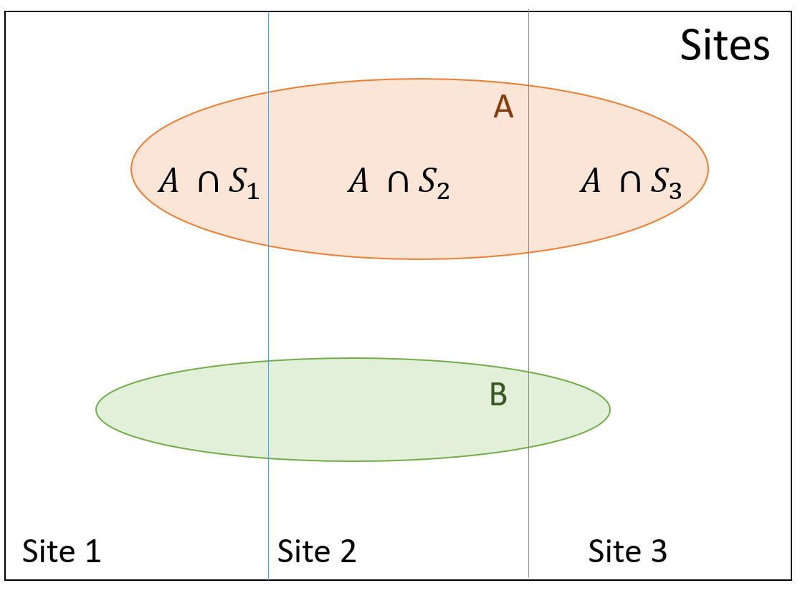

layout: true

.footnote[U.S. Department of Commerce | National Oceanic and Atmospheric Administration | National Marine Fisheries Service]


<style type="text/css">

code.cpp{
  font-size: 14px;
}
code.r{
  font-size: 14px;
}


</style>


```{r setup, include=FALSE}
options(htmltools.dir.version = FALSE)
```

```{r xaringan-tile-view, echo=FALSE}
# this gives you a tile navigation if you type "O" at any time
xaringanExtra::use_tile_view()
```


---
# Latent Variable Models

.p[
Data originate from a process with multiple sources of variability, not all of which are observable
- Causes:
  - Unobserved variability caused by grouping structure
  - Unobserved spatial and/or temporal process
- Statistical consequence: 
  - Data are not independent
- Includes: 
  - mixed-effects models
  - random-effects models
  - hierarchical models
  - state-space models
]

---
# Fixed versus Random Effects


.pull-left[
<br>
$\eta = \beta0 + \beta_{1} temp + \beta_{tank}$

<br>

|           |Linear                         |Generalized Linear               |
|-----------|-------------------------------|---------------------------------|
| **FE Model**  |$$y \sim Normal(\eta, \sigma)$$|$$y \sim Poisson(exp(\eta))$$|
| **Mixed <br>Model** | $$\begin{align} y\lvert tank &\sim Normal(\eta, \sigma_y) \\ tank &\sim Normal(\eta, \sigma_{RE})\end{align}$$| $$\begin{align} y\lvert tank &\sim Poisson(exp(\eta)) \\ tank &\sim Normal(\eta, \sigma_{RE})\end{align}$$ |

]

.pull-right-narrow[
```{r, echo = FALSE, out.width="60%", fig.align="left"}
knitr::include_graphics("static/glm-glmm-table.png")
```
]
---
## Joint, Conditional, and Marginal Probability
.pull-left[
<br>
**Joint Probability**: $$P(A\cap B) = P(A,B)$$

]

.pull-right[
```{r, echo = FALSE}
library(ggVennDiagram)
library(ggplot2)
set.seed(1)
C <- diag(2)
C[1,2] <- C[2,1] <- 0.7
obs <- mvtnorm::rmvnorm(1000, c(0,0), sigma=C)
x <- list(A = obs[,1], B = obs[,2])
venn <- Venn(x)
dat <- process_data(venn)
venn.reg <- venn_region(dat)
venn.reg$fill <- c(1,2,3)
ggplot() + 
  geom_sf(aes(fill = fill), data = venn.reg) +
  geom_sf(aes(color = id), data = venn_setedge(dat)) +
  geom_sf_text(aes(label = name), fontface = "bold", size = 8, 
               data = venn_setlabel(dat)) +
  theme_void() + 
  theme(legend.position = "none") + 
  scale_fill_gradient(low = "grey90", high = "gray20") + 
  scale_color_manual(values = rep("black",2))
```
]

---
## Joint, Conditional, and Marginal Probability
.pull-left[
<br>
**Joint Probability**: $$P(A\cap B) = P(A,B)$$<br>

**Marginal Probability**: $$P(B)$$

]

.pull-right[
```{r, echo = FALSE}
library(ggVennDiagram)
library(ggplot2)
set.seed(1)
C <- diag(2)
C[1,2] <- C[2,1] <- 0.7
obs <- mvtnorm::rmvnorm(1000, c(0,0), sigma=C)
x <- list(A = obs[,1], B = obs[,2])
venn <- Venn(x)
dat <- process_data(venn)
venn.reg <- venn_region(dat)
venn.reg$fill <- c(1,2,2)
ggplot() + 
  geom_sf(aes(fill = fill), data = venn.reg) +
  geom_sf(aes(color = id), data = venn_setedge(dat)) +
  geom_sf_text(aes(label = name), fontface = "bold", size = 8, 
               data = venn_setlabel(dat)) +
  theme_void() + 
  theme(legend.position = "none") + 
  scale_fill_gradient(low = "white",high = "grey90") + 
  scale_color_manual(values = c("white","black"))
```
]

---
## Joint, Conditional, and Marginal Probability
.pull-left[
<br>
**Joint Probability**: $$P(A\cap B) = P(A,B)$$<br>

**Marginal Probability**: $$P(B)$$<br>

**Conditional Probability**: $$P(A|B)$$<br>

$$P(A|B) = \frac{P(A,B)}{P(B)}$$

]

.pull-right[
```{r, echo = FALSE}
library(ggVennDiagram)
library(ggplot2)
set.seed(1)
C <- diag(2)
C[1,2] <- C[2,1] <- 0.7
obs <- mvtnorm::rmvnorm(1000, c(0,0), sigma=C)
x <- list(A = obs[,1], B = obs[,2])
venn <- Venn(x)
dat <- process_data(venn)
venn.reg <- venn_region(dat)
venn.reg$fill <- c(1,2,3)
ggplot() + 
  geom_sf(aes(fill = fill), data = venn.reg) +
  geom_sf(aes(color = id), data = venn_setedge(dat)) +
  geom_sf_text(aes(label = name), fontface = "bold", size = 8, 
               data = venn_setlabel(dat)) +
  theme_void() + 
  theme(legend.position = "none") + 
  scale_fill_gradient(low = "white" , high = "grey70") + 
  scale_color_manual(values = c("white", "black",2))
```
]
---
# Continuous examples
<br>

.pull-left[
**Joint density** $$f(A,B)$$
]

.pull-right[
```{r, echo = FALSE, out.width="90%", fig.align="left"}
library(ggExtra)

df <- data.frame(x = obs[,1], y = obs[,2])

p <- ggplot(df, aes(x = x, y = y)) + geom_point() +  
  theme_bw() + 
  theme(legend.position = "none") + ylab("A") + xlab("B")

p
```
]

---
# Continuous examples
<br>

.pull-left[
**Joint density** $$f(A,B)$$
**Marginal density** $$f(A)$$
]

.pull-right[
```{r, echo = FALSE, out.width="90%", fig.align="left"}
library(ggExtra)

df <- data.frame(x = obs[,1], y = obs[,2])

p <- ggplot(df, aes(x = x, y = y)) + geom_point() +  
  theme_bw() + 
  theme(legend.position = "none") + ylab("A") + xlab("B")

p2 <- ggMarginal(p, margins = 'y', type = "densigram") 

p2
```
]

---
# Continuous examples
<br>

.pull-left[
**Joint density** $$f(A,B)$$
**Marginal density** $$f(A)$$
**Conditional density**
$$f(A|B=1)$$
]

.pull-right[
```{r, echo = FALSE, out.width="90%", fig.align="left"}
library(ggExtra)

df <- data.frame(x = obs[,1], y = obs[,2])

p <- ggplot( df[which(df$x < 1.05 & df$x > 0.95),], aes(x = x, y = y))+ geom_point() +  
  geom_point(data = df) +
  theme_bw() + 
  theme(legend.position = "none") + ylab("A") + xlab("B") + 
  geom_vline(xintercept = 1)

p2 <- ggMarginal(p, margins = 'y', type = "densigram") 

p2
```
]
---
# Marginalization - Discrete
<br>
.pull-left[
\begin{align}
P(Species = A) &= \sum^{3}_{i=1}P(Site_{i},A)\\
&= \sum^{3}_{i=1}P(A|Site_{i})P(Site_{i})
\end{align}
<br>

```{r, echo=FALSE, results = "asis"}
library(summarytools)
library(kableExtra)
df <- data.frame(Species = c(rep("A", 203), rep("B", 87)),
                 Site = c(rep("1", 41), rep("2", 98), rep("3", 64),
                          rep("1", 12), rep("2", 52), rep("3", 23)))
kbl(table(df)%>%addmargins) %>% kable_styling(htmltable_class = "lightable-classic") %>% add_header_above(c("Species","Site"=3," ")) 

```

]

.pull-right[
```{r, echo = FALSE, out.width="100%", fig.align="left"}

```
]
---
# Marginalization - Continuous
<br>
.pull-left[
\begin{align}
f(B) &= \int_{\mathbb{R}} f(A,B)dA\\
&\\
&= \int_{\mathbb{R}}f(B|A)f(A)dA
\end{align}
]

.pull-right[
```{r, echo = FALSE, out.width="90%", fig.align="left"}
library(ggExtra)

df <- data.frame(x = obs[,1], y = obs[,2])

p <- ggplot(df, aes(x=x, y=y)) + geom_point() +
  theme_bw() + 
  theme(legend.position = "none") + ylab("A") + xlab("B")

p2 <- ggMarginal(p, margins = 'x', type = "densigram")

p2
```
]
---

# Likelihood of a Hierarchical Model

Data: $y$<br>
Random effect: $u$<br>
Parameters: $\Theta = (\theta_{y}, \theta_{u})$

.pull-left[
**Bayesian Inference**
\begin{align}
L(\Theta|y) &= \frac{f(y,u,\Theta)}{f(y)}\\
L(\Theta|y) &= \frac{f(y|u,\theta_{y})f(u|\theta_{u})f(\Theta)}{f(y)}\\
&\\
&= \frac{f(y|u,\theta_{y})f(u|\theta_{u})f(\Theta)}{\int_{\mathbb{R}}f(y,u,\Theta)dud\Theta}
\end{align}

- Posterior density of $\Theta$
]

.pull-right[
**MLE Inference** 
\begin{align}
L(\Theta) &= \int_{\mathbb{R}}f(y,u;\Theta)du\\
&\\
&= \int_{\mathbb{R}}f(y|u; \theta_{y})f(u;\theta_{u})du
\end{align}
<br><br>

- Point estimate of $\Theta$ with confidence intervals
]

---

# Likelihood of a Hierarchical Model

Data: $y$<br>
Random effect: $u$<br>
Parameters: $\Theta = (\theta_{y}, \theta_{u})$

.pull-left[
**Bayesian Inference**
$$L(\Theta|y) = \frac{f(y,u,\Theta)}{f(y)}$$

- Exact
 - Conjugate Priors
 - Numerical Integration
- Approximations:
 - MCMC Simulations - Metropolis Hastings, Gibbs Sampler, Hamiltonian Monte Carlo
 - Integrated Nested Laplace Approximation (INLA)
]

.pull-right[
**MLE Inference** 
$$L(\Theta) = \int_{\mathbb{R}}f(y,u;\Theta)du$$

- Exact
 - Newton-Rhapsom Algorithm
 - Expectation-Maximization Algorithm
 - Numerical integration
- Approximations:
 - Penalized Likelihood
 - Laplace approximation
 - Gauss-Hermite quadrature

]

---
# Laplace Approximation

.pull-left[
**Bayesian Inference**
$$L(\Theta|y) = \frac{f(y,u,\Theta)}{f(y)}$$
]

.pull-right[
**MLE Inference** 
$$L(\Theta) = \int_{\mathbb{R}}f(y,u;\Theta)du$$

]<br>
```{r, echo = FALSE, out.width="50%", fig.align="center"}
knitr::include_graphics("static/laplace-accuracy.png")
```
<br>
Figure from [Albertsen, C. M. (2018), 2.3.1](https://backend.orbit.dtu.dk/ws/portalfiles/portal/157133664/Publishers_version.pdf)
]
---
# Laplace approximation<br>
<br>

.pull-left[
1. Random effects likelihood is minimized to find $\hat{u}$
2. 2nd derivatives of $f(y,u|\theta)$ w.r.t. $u$ is evaluated at $\hat{u}(\theta)$
3. Taylor Series expansion around $\hat{u}$ to approximate the marginal
]
.pull-right[
\begin{align}
\hat{u}(\theta) &= \underset{u}{argmin}f(u,\theta)\\
\mathbb{H}(\theta) &= f^{"}_{uu}(\hat{u}(\theta), \theta)\\
&\\
L^{*}(\theta) &= \sqrt{2\pi}^{n}det(\mathbb{H})^{-1/2}f(y,\hat{u}; \theta)
\end{align}
]

<br>

Changes the problem from **integration** $\rightarrow$ **optimization** <br>

$$L(\theta) = \int_{\mathbb{R}}f(y,u;\theta)f(u;\theta)du \hspace{1cm}\rightarrow\hspace{1cm} L^{*}(\theta) = \sqrt{2\pi}^{n}det(\mathbb{H})^{-1/2}f(y,\hat{u}; \theta)$$
